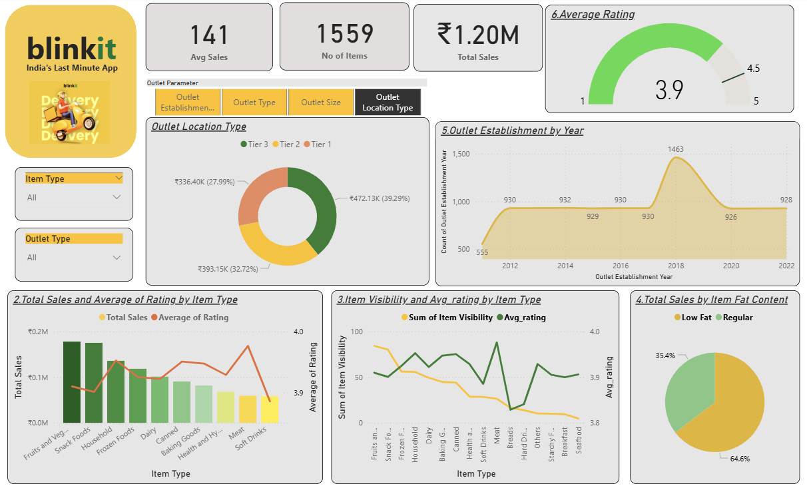

# Blinkit-Sales-Analysis-Dashboard-
## 📊 Dashboard Preview

Blinkit Sales Dashboard ,
This project analyzes sales, customer ratings, and outlet performance to uncover key business insights.
🔍 Key Insights
1. Sales by Outlet Type
One outlet type contributes ~65% of total revenue
Remaining outlet types are evenly distributed but significantly smaller
2. Sales by Outlet Size
Medium (~42%) and small (~37%) outlets perform best
Large outlets (~21%) underperform relative to capacity
3. Sales by Location
Tier 3 leads (~39%), followed by Tier 2 (~33%) and Tier 1 (~28%)
Tier 1 shows underutilized potential
4. Sales & Ratings by Item Type
Top categories: Fruits & Vegetables, Snack Foods
Soft Drinks: highest ratings, lowest sales
5. Visibility vs Ratings
High visibility ≠ high satisfaction (e.g., Fruits & Vegetables)
Meat & Breads: high ratings but low visibility
Seafood: weakest in both
6. Fat Content Trends
Low-fat products dominate (64.6%)
Indicates strong health-conscious demand
7. Outlet Expansion
Peak in 2018 (1,463 outlets), followed by stabilization (~928)
8. Customer Rating
Average rating: 3.9 / 5

💡 Recommendations
Reduce dependency on top-performing outlet type
Improve performance of large outlets
Expand high-performing Tier 3 strategies
Increase visibility of high-rated, low-exposure products
Leverage demand for low-fat products
Focus on operational efficiency over rapid expansion
Improve customer experience to push ratings above 4.2
